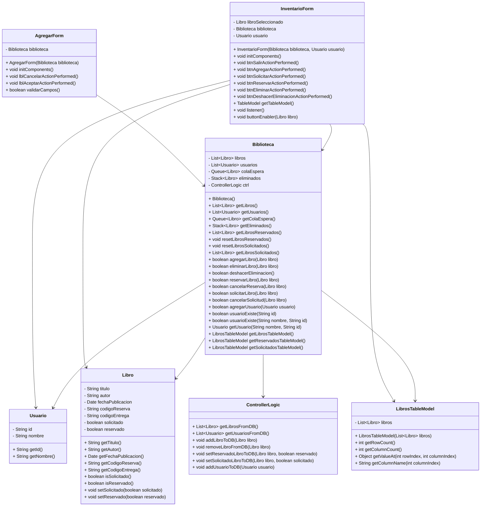

# Proyecto Biblioteca

Este proyecto es una aplicación de gestión de una biblioteca, que permite realizar operaciones como agregar libros, eliminarlos, solicitarlos y reservarlos. La aplicación está construida en Java y utiliza la biblioteca Swing para la interfaz gráfica de usuario.

## Estructura del Proyecto

El proyecto se divide en varias clases clave que gestionan las diferentes funcionalidades de la biblioteca:

- **Biblioteca**: Clase principal que maneja la lógica de la biblioteca.
- **Libro**: Representa un libro en la biblioteca.
- **Usuario**: Representa un usuario de la biblioteca.
- **LibrosTableModel**: Modelo de tabla para mostrar los libros en la interfaz gráfica.
- **ControllerLogic**: Controlador que maneja la interacción con la base de datos.
- **InventarioForm**: Interfaz gráfica para la gestión del inventario de libros.
- **AgregarForm**: Interfaz gráfica para agregar un nuevo libro a la biblioteca.

## Diagrama de Clases

## Descripción de las Clases

### Biblioteca

La clase `Biblioteca` gestiona la colección de libros y usuarios. Permite agregar, eliminar, reservar y solicitar libros, así como agregar usuarios y consultar la existencia de un usuario.

### Libro

La clase `Libro` representa un libro con atributos como título, autor, fecha de publicación, códigos de reserva y solicitud, y estados de reserva y solicitud.

### Usuario

La clase `Usuario` representa a un usuario de la biblioteca con atributos como ID y nombre.

### LibrosTableModel

La clase `LibrosTableModel` es un modelo de tabla para mostrar los libros en una interfaz gráfica, utilizando la lista de libros.

### ControllerLogic

La clase `ControllerLogic` maneja la interacción con la base de datos, incluyendo la recuperación y actualización de información sobre libros y usuarios.

### InventarioForm

La clase `InventarioForm` es una interfaz gráfica para la gestión del inventario de libros, permitiendo operaciones como agregar, eliminar, solicitar y reservar libros.

### AgregarForm

La clase `AgregarForm` es una interfaz gráfica para agregar un nuevo libro a la biblioteca, con validación de los campos de entrada.

## Uso

Para utilizar la aplicación, simplemente ejecute la clase principal que inicia la interfaz gráfica y siga las instrucciones en pantalla para gestionar el inventario de la biblioteca.
